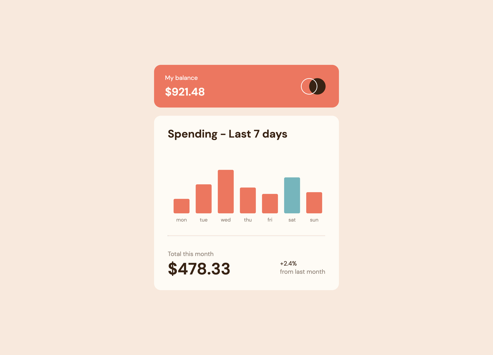
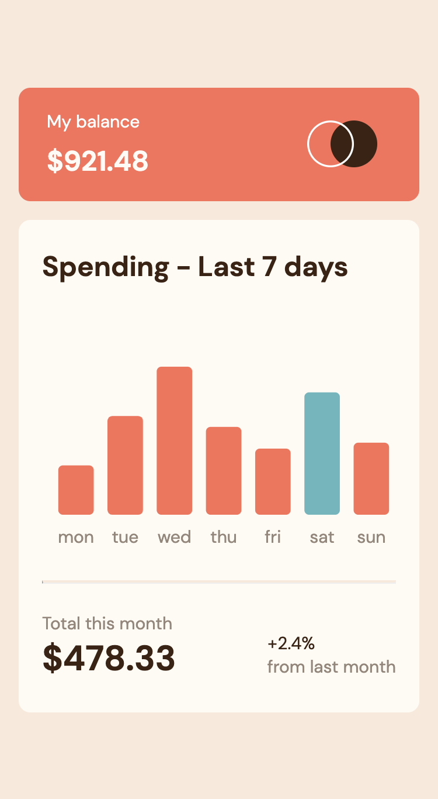

# Frontend Mentor - Expenses chart component solution

This is a solution to the [Expenses chart component challenge on Frontend Mentor](https://www.frontendmentor.io/challenges/expenses-chart-component-e7yJBUdjwt). Frontend Mentor challenges help you improve your coding skills by building realistic projects. 

## Table of contents

- [Overview](#overview)
  - [The challenge](#the-challenge)
  - [Screenshot](#screenshot)
  - [Links](#links)
- [My process](#my-process)
  - [Built with](#built-with)
  - [What I learned](#what-i-learned)
  - [Continued development](#continued-development)
  - [Useful resources](#useful-resources)
- [Author](#author)

## Overview

### The challenge

Users should be able to:

- View the bar chart and hover over the individual bars to see the correct amounts for each day
- See the current day’s bar highlighted in a different colour to the other bars
- View the optimal layout for the content depending on their device’s screen size
- See hover states for all interactive elements on the page
- **Bonus**: Use the JSON data file provided to dynamically size the bars on the chart

### Screenshot

### Links

- Solution URL: [Solution](https://github.com/andyjv1/Expenses-chart-component.git)
- Live Site URL: [Live](https://main--incomparable-melba-27fcd7.netlify.app/)

## My process

### Built with

- Semantic HTML5 markup
- CSS custom properties
- Flexbox
- Mobile-first workflow
- React
- Chartjs

### What I learned

This is my first react project. This  was a great way for me to learn more about react. I also learned how to use Chart.js beceause it was my first time using this library.

### Useful resources

- [Chart.js](https://www.chartjs.org/docs/latest/) - This helped me learn how to use Chartjs

## Author

- Frontend Mentor - [@andyjv1](https://www.frontendmentor.io/profile/andyjv1)
